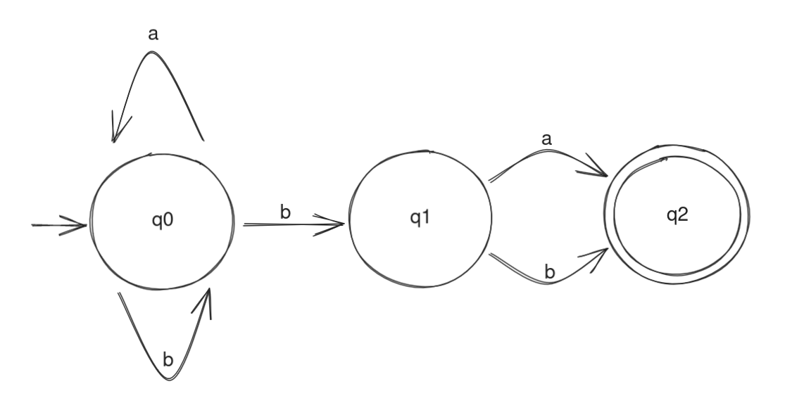
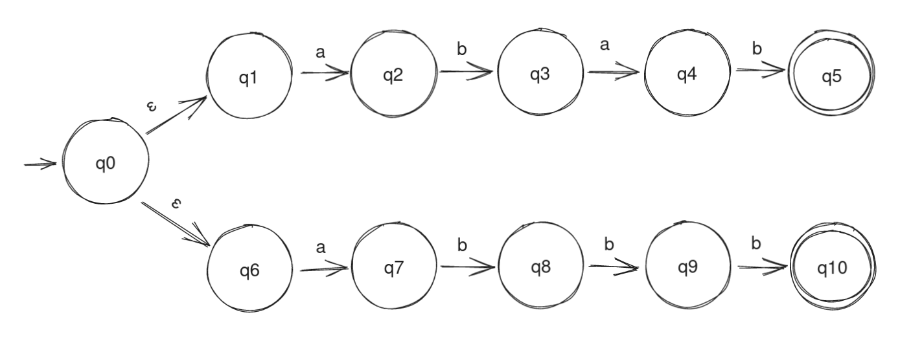

# NFA runner

This simple Java application is intended for running non-deterministic finite automata (NFAs). 

It can also run the same deterministic state automata (DFAs) as [UDFA](https://github.com/SpinningVinyl/UDFA), since every DFA is also an NFA.

To run the application:

```bash
java nfa file
```
Where `file` is a file containing the description of the automaton.

## NFA description file

The syntax of the NFA description file is very simple. 

### Comments

Lines beginning with `#` (hash sign) are comments:

```
# This is a comment
```

### States

Line beginning with `Q:` (uppercase Q followed by a colon) lists all states of the NFA, separated by commas.

```
Q:q0,q1,q2,q3
```

Line beginning with `S:` (uppercase S followed by a colon) lists the initial states. The initial states should be already defined in the `Q:` line:

```
S:q0,q1
```

Line beginning with `A:` (uppercase A followed by a colon) lists the acceptance states of the NFA. The acceptance states should be already defined in the `Q:` line:

```
A:q2,q3
```

### Alphabet

Line beginning with `L:` (uppercase L followed by a colon) lists all symbols in the alphabet on which the NFA operates.

```
L:a,b,c,d
```

### Transitions

Transitions are defined in the following way: `old_state,symbol->new_state1,new_state2,...`, e.g.:

```
q0,d->q2,q3
```

Null transitions (epsilon-transitions) are defined as following: `old_state->new_state1,new_state2,...`, e.g.:

```
q0->q1,q3
```

Needless to say, all states and symbols should be already defined in the `Q:` and `L:` lines.

## Examples

Consider the following NFA. It operates on the alphabet consisting of symbols `(a,b)` and accepts all words where `b` is the penultimate symbol (e.g. ba, aba, bbb, abbababababb etc.):



An NFA file describing this state machine would look like this:

```
# this NFA accepts all strings where b is the penultimate character, e.g. ba, aba, bbb, aaaabbbbaaaba etc.
Q: q0,q1,q2
L: a,b
S: q0
A: q2
q0,b->q0,q1
q0,a->q0
q1,a->q2
q1,b->q2
```

The following state machine recognises the string `abab|abbb` (that is, abab *or* abbb):



An NFA file describing this state machine would look like this:

```
# this NFA recognizes the string abab|abbb
Q:q0,q1,q2,q3,q4,q5,q6,q7,q8,q9,q10
L:a,b
S:q0
A:q5,q10
# null transitions
q0->q1,q6
# normal transitions
q1,a->q2
q2,b->q3
q3,a->q4
q4,b->q5
q6,a->q7
q7,b->q8
q8,b->q9
q9,b->q10
```